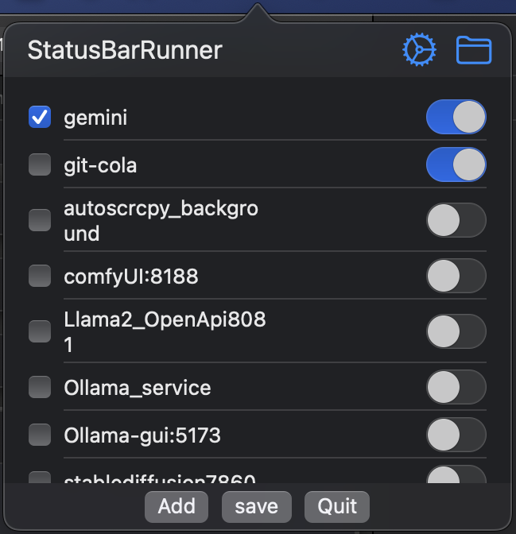
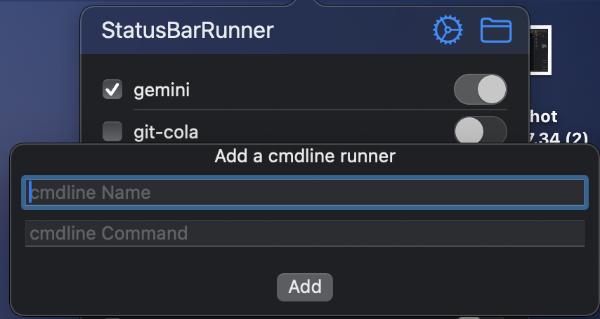

# StatusBarRunner

## Content

This is a startup tools , you can use it to startup bash scripts in background. 

The size of this app is just less than 10m. 

## Usage

1. Unpack the app and copy it to /Applications , then open the app and you can see an "R" icon in the Status bar.

2. You can add or modify commands like this:
` cd /Users/xxx/GeminiProChat-main&&node dist/server/entry.mjs`
then add a name. Then you can start the command in background.




3. Each item in the list has 2 optons:

- Left checkbox : start when logging in.
- Right switch : on or off.

4. Click the add button to add an item :



5. Click the item text to edit the item .

6. you can drag items to change the order .

7. If you have modified something, you can click the Save button.

8. The config file is ~/.statusBarRunner.json, you can modify it with a backup.

9. I don't have an apple developer ID  and this app is not signed, you can use the following terminal commands to be able to use this app.

```bash
sudo spctl --master-disable
sudo xattr -r -d com.apple.quarantine /Applications/StatusBarRunner.app
```

## contact me

my mail:zazaji@sina.com